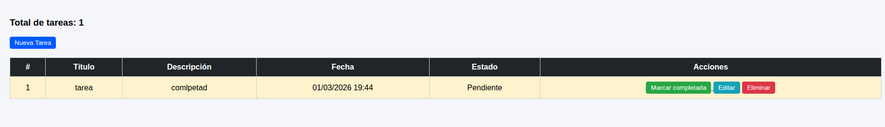
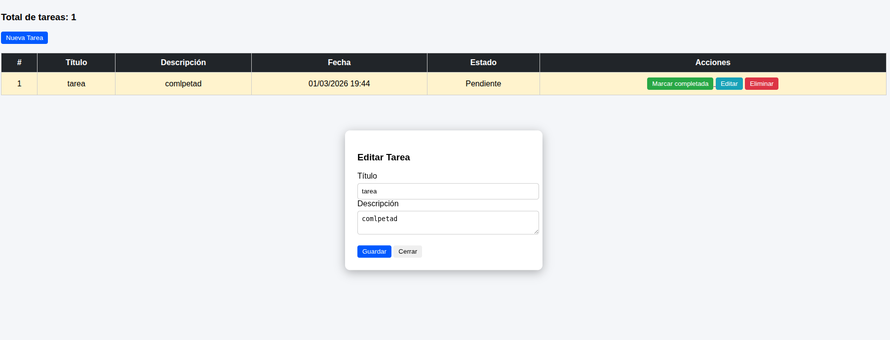
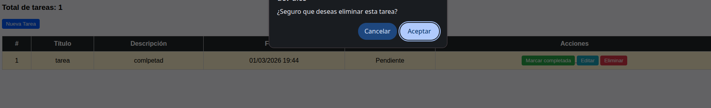

# Gestión de Tareas - Actividad 4 Colaborativo

Aplicación web desarrollada con **Flask** y **MySQL** para gestionar tareas.

## Integrantes

- Jhimy Fuentes Rojas
- Limberg Edgar Montes Tancara

## Tecnologías

- Python / Flask
- MySQL
- HTML / CSS

## Instalación

```bash
# 1. Instalar dependencias
pip install -r requirements.txt

# 2. Levantar MySQL y crear la base de datos
mysql -u root -p < BaseDeDatos.sql

# 3. Ejecutar la aplicacion
python app.py
```

Se debe ingresar a la sigueitne url `http://localhost:5000`

## Funcionalidades

### Listar tareas

Muestra todas las tareas



---

### Editar tarea

Permite modificar la tarea



---

### Eliminar tarea

Elimina una tarea



---
